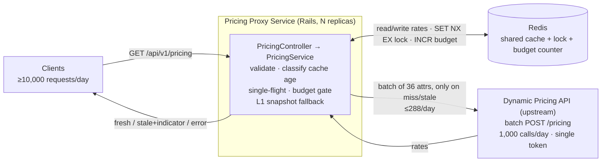

# Dynamic Pricing Proxy - Technical Design Document

**Author:** Tira Sundara (sundaralinus@gmail.com)  
**Date:** 2026-06-13  
**Status:** Proposed

## Problem Statement

Tripla uses a dynamic pricing API (an AI/ML model) to maximize revenue and occupancy. The model is computationally expensive, but its outputs remain effective for up to 5 minutes. That 5-minute validity window is the optimization opportunity.

The constraints make a naive proxy impossible:
- The pricing API is capped at **1,000 requests per day per token**, and only **one token** is permitted.
- The service must handle **at least 10,000 requests per day** from users.

So the service must serve ≥10,000 user requests/day from a budget of <1,000 upstream calls/day, while keeping every served rate no older than 5 minutes under normal operation, and degrade gracefully when the upstream or its own dependencies fail.

## Goals

- Serve hotel room rates to ≥10,000 daily user requests while consuming fewer than 1,000 upstream API calls per day, with rates never older than 5 minutes under normal operating conditions.
- Never return an unhandled exception: every request yields a fresh rate, a stale rate with an explicit indicator, or a descriptive error.

## Non-Goals

- Scaling beyond the current attribute space (4 periods × 3 hotels × 3 room types = 36 combinations). Several decisions below (single cache key, full-batch refresh, per-process snapshot) are deliberately sized to 36 combinations and are called out where they would not scale.
- Storing rates in a relational database or other durable storage.
- Multi-token support to raise the daily budget.
- Handling the hotel booking / payment flow.

## Background / Context

The original scaffold fetched the upstream API on every request, with no batching, caching, or failure handling. At ≥10,000 requests/day that means ≥10,000 upstream calls/day, roughly 10× over budget, plus unnecessary latency on every call. The work here replaces that path with a cached, batched, single-flight design and an explicit degradation path.

## Requirements

### Functional Requirements

- Validate input parameters and reject unrecognized `(period, hotel, room)` combinations with a **400** and the list of supported values. (See [Status codes](#status-codes-400-vs-422) for why 400 rather than 422.)
- Under normal conditions, return a rate no older than 5 minutes for any valid combination.
- Handle ≥10,000 user requests/day while staying within 1,000 upstream calls/day.
- Under degradation: if the upstream is unavailable but a usable (within max-stale) cache entry exists, return the stale rate with an explicit staleness indicator. If no usable entry exists, return a descriptive **503**.

### Non-Functional Requirements

- The service returns a response for every request (fresh rate, stale rate with indicator, or descriptive error) and never leaks an unhandled exception.

## Critical Findings

**Constraints:**
- Upstream capped at 1,000 requests/day on a single token.
- ≥10,000 user requests/day.
- Rate data valid for up to 5 minutes.
- 36 valid combinations (4 periods × 3 hotels × 3 rooms).
- A day holds (24 × 60) / 5 = **288 five-minute windows**.

**Observed upstream behavior (verified locally):** intermittent failures arrive in two forms, HTTP 500 and HTTP 200 carrying a `{"status":"error"}` envelope, together on about 14% of calls (28 of 200 sampled); the rate limit returns HTTP 429, a missing or invalid token returns HTTP 401, and the `rate` field is a JSON number. The API documents no error contract, so all of this was confirmed by running the image. Notably a 200 does not imply success, which is why the client checks the envelope and the validator checks the payload.

**Critical math (why batching is required, not optional):**
- Without batching (one upstream call per combination per cache miss): worst case 36 × 288 = **10,368 calls/day**, far over budget.
- With batching (one upstream call refreshes all 36 combinations per window): worst case **288 calls/day**, comfortably under 1,000.

Conclusion: batching is a **requirement**. The pricing API's batch endpoint accepts an `attributes` array, so one call returns all 36 rates.

## Options Considered

### Option 1: Always fetch on demand, no caching, no batching

**Pros:** Simple.  
**Cons:** ~10,000 upstream calls/day (over budget by 10×); upstream latency on every request.  
**Verdict:** Reject.

### Option 2: Fetch on demand with caching + batching, no single-flight locking

Cache duration 5 minutes.

**Pros:** Drastically fewer upstream calls (~288/day if no stampede); no new components beyond a cache.  
**Cons:** Cache stampede risk: concurrent requests on a cold/expired key each trigger a refresh, multiplying upstream calls under load.  
**Verdict:** Reject, but a good starting point.

### Option 3: Fetch on demand with caching + batching + single-flight locking (CHOSEN)

**Pros:** ~288 upstream calls/day worst case; single-flight collapses concurrent refreshes to one upstream call per window; no background infrastructure.  
**Cons:** Added latency on cold start / cache miss; lock adds some complexity. The complexity is justified: it trades a little code for budget safety, and Redis (already needed as the shared cache) provides the lock primitive, so no new dependency.  
**Verdict:** Accept. Best balance of simplicity and budget safety.

### Option 4: Scheduled background cache refresh

**Pros:** Cache stays warm; no refresh latency on the request path; ~360 calls/day at a 4-minute cadence; no stampede.  
**Cons:** A background worker is a new moving part with its own monitoring, and is itself a single point of failure (SPOF). If it dies, the cache silently goes stale. It still needs a request-path fallback (i.e. Option 3) for cold start and worker failure, so it's strictly additive complexity over Option 3.  
**Verdict:** Reject for now. Captured as [Future Work](#future-work) (refresh-ahead) layered on top of Option 3, where it carries no SPOF risk.

## Proposed Solution

### Architecture

High-level topology. One Redis backs the cache, the single-flight lock, and the daily budget counter, which is what keeps the budget cap correct across multiple proxy replicas. The proxy calls the upstream only on a miss or stale entry, so client load (≥10,000/day) is decoupled from upstream load (≤288/day, well under the 1,000/day cap).



Request lifecycle and decision flow:

```
        ┌──────────────┐
client ─▶│  Controller  │  validate params (400 on bad input)
        └──────┬───────┘
               ▼
        ┌──────────────┐
        │PricingService│  read cache → classify by age
        └──────┬───────┘
               │
   ┌───────────┼───────────────────────────────┐
   ▼           ▼                                ▼
 FRESH       STALE/MISS                      Redis down
(age<5m)   acquire single-flight lock      serve per-process
 serve     ┌─────────────┴───────────┐     L1 snapshot via
 hit       winner                 waiters    same classifier
           │                      poll cache  (no upstream call)
           ▼                      (~100ms,
     budget gate (≥limit?)        cap ~8s)
           │ ok
           ▼
     RateApiClient.fetch_all (batch 36, timeouts)
           │
           ▼
     validate batch (all-or-nothing)
           │
      ┌────┴────┐
      ▼         ▼
   valid     invalid / upstream error / timeout
   write     keep old cache → degrade:
   cache       within max-stale → stale 200
   serve       else              → 503
   fresh
```

Every branch ends in exactly one of: fresh 200, stale 200 (with indicator), or descriptive 4xx/503. A single degradation classifier (fresh / stale / expired, by age) is reused across the upstream-failure, budget-gate, and Redis-down paths so there is one staleness code path, not three.

### Key Components

| Component | Responsibility |
| --- | --- |
| `Api::V1::PricingController` | Validate params (existing logic), call the service, render the uniform response body + cache headers. |
| `Api::V1::PricingService` | Orchestrate: classify cache age, run single-flight refresh or wait, apply budget gate, choose fresh/stale/error outcome. |
| `RateCache` (store wrapper) | Read/write the single batch entry in Redis; maintain the per-process **L1 snapshot** (in-process last-known-good copy, defined under [Critical Implementation Details](#redis-unavailable-l1-snapshot-degradation)); expose the age classifier (`fresh` / `stale` / `expired`). |
| `BudgetGate` | Pre-increment and check the date-keyed daily counter in Redis. |
| `RateApiClient` | Batch POST of all 36 attributes with explicit timeouts (extends the existing HTTParty client). |
| Notifications subscriber | Translate `ActiveSupport::Notifications` events into single-line JSON logs and derive metrics. |

### Key Decisions

- **Redis as shared cache + lock + budget backend, via `Rails.cache` (`redis_cache_store`).** Production runs more than one process/replica; a per-process cache means each of N processes can refresh on its own, so N × 288 can breach 1,000/day (e.g. 4 replicas × 288 = 1,152). Correctness of the budget cap therefore *requires* shared state. `Rails.cache` exposes `write(..., unless_exist: true)` (atomic `SET NX EX`, the lock primitive), `increment` (the budget counter), and a clean swap to a memory store in tests. I use the Rails cache abstraction rather than raw `redis-rb` to stay idiomatic; the few atomic operations needed are all reachable through it.
- **Single-flight locking** prevents concurrent refreshes of the key (the stampede in Option 2). One winner calls upstream; waiters poll the cache for a newer `fetched_at`.
- **Hard 5-minute ceiling on the normal path.** I keep the ceiling hard: stale-while-revalidate (SWR) is not used; a freshly-expired entry is refreshed before serving (waiters block briefly) rather than served stale. Staleness is permitted **only** on the documented degradation path. (SWR rejected; see [Alternatives](#alternatives-considered).)
- **Degradation serves stale with an explicit indicator**, not an immediate 503, while a usable entry exists. How long stale is acceptable is a *business* decision, so the ceiling is configurable (`PRICING_MAX_STALE_SECONDS`, default 3600). See [Assumptions](#assumptions).
- **Cold start + upstream failure → descriptive 503** (no entry to fall back to).
- **Redis down → never call upstream** (the budget and lock cannot be enforced without it), but serve a **per-process last-known-good snapshot** through the same staleness classifier when one exists; otherwise 503. See [Critical Implementation Details](#redis-unavailable-l1-snapshot-degradation).
- **Budget counter pre-increments attempts** (not successes), so it can never under-count versus the upstream's own metering. See [Critical Implementation Details](#budget-metering).

### Assumptions

- "No older than 5 minutes" is a hard ceiling (`age < 5min`) for all normal-path responses; staleness is permitted only on the documented degradation path.
- Under upstream failure, in the hotel **discovery** phase, showing a slightly stale rate beats showing "Service Unavailable". The longer stale is served, the higher the price-discrepancy risk, hence a configurable ceiling.
- The service MUST show a fresh/valid rate during the **payment** flow. Payment is out of scope here; this proxy targets discovery/browsing.
- Production may run >1 process/replica. Correctness (≤1,000/day) holds via shared Redis state even though the local demo may be single-instance.
- The upstream batch endpoint has no documented limit on `attributes` size; 36 items in one call is assumed acceptable.
- Redis is a required dependency for the budget cap and lock. If it is unavailable the service fails toward safety (no upstream calls) rather than risk exceeding the cap.
- The budget counter resets at **midnight UTC**. The upstream's actual reset timezone is unconfirmed (see [Open Questions](#open-questions)); a conservative gate threshold absorbs the uncertainty.
- The upstream returns `rate` as a JSON **number** (e.g. `27600`), although its own doc shows a string (`"12000"`). The proxy **normalizes `rate` to a digit string** in its stored and served representation: one stable, exact, client-facing type that we control, rather than leaking the upstream's inconsistent typing or a float-lossy JSON number (the convention pricing/payment APIs use for money). `BatchValidator` accepts either form from the upstream and validates a non-negative integer.

### Critical Implementation Details

#### Cache entry, TTL, and freshness

A single Redis key holds the whole batch:

```
pricing:rates:v1  →  { rates: { "<period>|<hotel>|<room>" => "<rate>", ... 36 entries }, fetched_at: <epoch> }
```

- **Key TTL (time-to-live) = max-stale ceiling** (`PRICING_MAX_STALE_SECONDS`, default 3600s), **not** 5 minutes. Redis expiry only reclaims data that is too old even for stale fallback. If the TTL were 5 minutes, the entry would vanish exactly when degradation needs it, turning every post-expiry upstream failure into a cold-start 503.
- **Freshness is computed at read time from `fetched_at`**, not from key existence:
  - `fresh`   ⇔ `age < 300s` → serve as a normal hit.
  - `stale`   ⇔ `300s ≤ age < max_stale` → trigger refresh; serve only on the degradation path.
  - `expired` ⇔ `age ≥ max_stale` → treat as missing.

#### Single-flight refresh

1. Reader sees a non-`fresh` entry and tries to acquire the lock: `Rails.cache.write(lock_key, owner, unless_exist: true, expires_in: LOCK_TTL)`.
2. **Winner** runs the budget gate, calls upstream, validates, and writes the new entry (which also updates `fetched_at`).
3. **Waiters** (lock not acquired) poll the cache key every ~100ms for a newer `fetched_at`, capped at `WAITER_CAP`. On a fresh value → serve it. On timeout → re-check the cache once, then degrade exactly like an upstream failure.
4. Lock self-releases via its TTL, so a crashed winner cannot wedge the key.

**Timeout invariant:** `open_timeout + read_timeout < WAITER_CAP < LOCK_TTL`. The upstream call is hard-capped at `open + read` (2 + 3 = 5s). Both `WAITER_CAP` and `LOCK_TTL` must exceed that: `LOCK_TTL` so the winner finishes inside the lock, `WAITER_CAP` so a waiter polls long enough to catch the winner's write. By ~5s the winner's attempt is settled (wrote on success, or failed), so a waiter degrades at `WAITER_CAP` just after the attempt window and before the lock's hard expiry, hence `WAITER_CAP < LOCK_TTL`. Defaults (all ENV-configurable):

| Setting | Default | Rationale |
| --- | --- | --- |
| `open_timeout` | 2s | Fail fast on connect. |
| `read_timeout` | 3s | Bounds the in-lock upstream wait (so the call is capped at ~5s). |
| `WAITER_CAP` | 8s | Exceeds the ~5s upstream worst case so a waiter catches the winner's write, then degrades before the lock expires. |
| `LOCK_TTL` | 10s | Exceeds both the upstream call and the waiter cap so the winner finishes before the lock self-releases. |

**No inline retries; the system retries at request cadence.** The upstream fails intermittently on ~14% of calls (measured locally): HTTP 500 and, about as often, HTTP 200 with a `{"status":"error"}` envelope. So transient failure is expected. A failed refresh is not retried within the request: under single-flight and ~10,000 requests/day, the winner degrades and releases the lock, and the next request re-attempts within seconds, so retries cost no added per-request latency while stale-fallback (rate at most ~5 minutes old) covers the gap. Timeouts are never retried: it would double tail latency for the whole waiter cohort, and a timed-out call may already be metered upstream, risking double-counting the real 1,000/day quota. A calibrated single retry on transient failures (5xx, connection, and the 200 error-envelope; not timeouts) was considered (turns those ~14% of failed refreshes from stale to fresh, ~8ms, idempotent) but left out for simplicity; see [Future Work](#future-work).

#### Budget metering

- Counter key `pricing:budget:<UTC-date>`, TTL ~48h (survives the day, self-reclaims).
- **Pre-increment inside the lock, before each upstream attempt.** This counts *attempts*, including timeouts. Because the upstream may meter a request even when the proxy times out reading the response, counting attempts guarantees the counter never under-counts versus the real quota. Over-counting is harmless given the 288-vs-1000 headroom.
- **Warn at `PRICING_BUDGET_WARN` (default 800); hard gate at `PRICING_BUDGET_LIMIT` (default 950).** Both ENV-configurable. At/after the limit the winner skips the upstream call and degrades (stale if available, else 503). The gate is a *backstop* against bugs (lock regression, crash loop), not the normal control; normal worst case is 288/day. Defaults sit near the 1,000/day cap on purpose: the gate's only job is to avoid blowing the cap, and legitimate usage never approaches it.

#### Upstream batch validation (all-or-nothing)

A 200 with a parseable body is **not** trusted blindly. The batch is accepted only if **all** hold:
- the body parses and `rates` is an array;
- building a `{ [period, hotel, room] => rate }` map yields **exactly the 36 requested combinations** (missing → reject; this also makes duplicates and unexpected extras detectable);
- every rate is a **non-negative integer**, accepted as a JSON number or a digit string and normalized to a digit string (rejects `null`, `""`, `"abc"`, negatives, and non-integers).

On any failure: reject the **entire** batch, **keep the existing cache entry untouched**, log `upstream_failure` with a reason (e.g. `invalid_batch: missing 2 combos`), and let the degradation path serve the request, identical handling to an upstream 5xx. Combined with pre-increment, a rejected batch still costs one budget unit, which is correct: the upstream did the work.

#### Redis unavailable: L1 snapshot degradation

On every successful Redis read/write, the store wrapper also caches the batch in a process-long-lived **L1 snapshot**: a level-1, in-process copy held as a frozen object on the store class, replaced by whole-reference assignment (atomic in MRI, the reference C implementation of Ruby, so no mutex). When a Redis operation raises a connection error:

- The service **never** calls upstream (budget/lock unenforceable; absolute rule).
- If the snapshot exists and is within max-stale, serve it through the same classifier with `stale: true`; otherwise 503.

This shrinks the blast radius of a Redis blip from "full outage" to "staleness flagged on the wire," bounded by the same max-stale ceiling.

**Explicitly flagged limitations** (acceptable for this assignment, not silently assumed):
- **Per-process and ephemeral.** The snapshot lives in one process's heap. A process that restarted during the outage, or has not served traffic since boot, has an empty snapshot and will 503. This is a best-effort mitigation, not high availability.
- **Read-only during the outage.** It never refreshes while Redis is down; staleness grows monotonically until Redis returns or max-stale expires it.
- **Memory/scaling caveat.** The snapshot is a full copy of the batch *per process*. At 36 combinations it is a few KB and a non-issue. At a large combination space (e.g. 100k combos × N processes) the per-process copy becomes real memory pressure and the mechanism would need rethinking (size cap, partial snapshot, or dropping it). This pairs with the Non-Goal on not scaling beyond 36 combinations.

### Data Models

Single cache entry (see [above](#cache-entry-ttl-and-freshness)):

```
pricing:rates:v1  →  { rates: { <36 combos> => "<rate string>" }, fetched_at: <epoch> }
  TTL = PRICING_MAX_STALE_SECONDS (default 3600s)
  fresh ⇔ (now - fetched_at) < 300s
```

Supporting keys:

```
pricing:rates:lock      →  <owner token>   TTL = LOCK_TTL (10s)      single-flight lock
pricing:budget:<date>   →  <integer>       TTL ~48h                  daily attempt counter (UTC date)
```

### Response Contract

All success responses (fresh and stale) share one **additive** body shape over the scaffold's `{ rate }`:

```json
{ "rate": "12000", "stale": false, "as_of": "2026-06-13T10:30:00Z" }
```

Plus infrastructure-layer headers on every response:
- `Age`: seconds since `fetched_at`.
- `X-Cache-Status`: `hit` (fresh), `miss` (just refreshed), or `stale` (degradation path).

Stale responses are **200** (the body's `stale: true` and the headers carry the signal). Keeping one body shape across modes means a client coded against the fresh path does not misparse the degraded path; exposing the same signal in headers lets infra/proxies act on it without parsing JSON.

Error responses (400 validation, 503 degradation) share a consistent shape:

```json
{ "error": "Service temporarily unavailable: no recent rate for the requested room." }
```

## Failure Modes and Mitigations

| # | Failure Mode | Mitigation |
| --- | --- | --- |
| 1 | Invalid user input (missing or unsupported parameters) | Controller validates against the known valid sets before any cache/upstream work. Return **400** with the supported values. Never cached, never hits upstream. |
| 2 | Upstream returns partial/malformed batch (≠36 combos, null/blank/non-numeric rates) | All-or-nothing: reject the whole batch, log the reason, keep the existing cache entry. Degrade like an upstream error. |
| 3 | Upstream down / erroring / timeout / rate-limited | Usable cache entry exists → serve `stale: true` (+ log/metric). No usable entry (cold start) → descriptive **503**. |
| 4 | Redis down | Never call upstream (budget/lock unenforceable). Serve per-process L1 snapshot as `stale: true` if present and within max-stale; otherwise **503**. Log + alert. |
| 5 | Lock holder crashes mid-refresh | Lock has TTL (`SET NX EX`); it self-releases after `LOCK_TTL`, so the key cannot wedge. |
| 6 | Waiter polls indefinitely | Waiter-side cap (`WAITER_CAP`, set a little under `LOCK_TTL`). On timeout, re-check cache once, then degrade. |
| 7 | Budget exhausted / runaway refresh | Pre-incremented daily counter; hard gate at `PRICING_BUDGET_LIMIT` (default 950) skips upstream and degrades, capping spend regardless of bugs upstream of it. |

## Observability

Single source of truth: **structured JSON logs**, one event per line, emitted by a single `ActiveSupport::Notifications` subscriber and correlated by `request_id`. Metrics are *derived* from these events (a counter is a count of an event; a histogram is an aggregation of a duration field), and alerts are log-based monitors. This needs zero new infrastructure and works uniformly across all replicas. The one number that lives in Redis rather than logs is the budget counter, which the `/internal/stats` endpoint reads directly.

Prometheus/Grafana was considered and **rejected** as over-engineering for this assignment (and `prometheus-client`'s default per-process store is incorrect under multi-worker Puma, exactly the topology this design targets). The Notifications subscriber is the seam: swapping the JSON logger for a StatsD/Prometheus emitter is the documented production path. See [Alternatives](#alternatives-considered).

### Operational endpoint

`GET /internal/stats` returns live values for quick inspection / curl during review:

```json
{ "calls_today": 142, "calls_remaining": 858, "cache_age_seconds": 37, "cache_status": "fresh" }
```

### Metrics

Each metric is derived from a log event/field rather than a separate instrumentation backend:

| Metric | Type | Derived from | Purpose |
| --- | --- | --- | --- |
| `pricing.cache.hits` | Counter | count of `cache_hit` | Cache hits |
| `pricing.cache.misses` | Counter | count of `cache_missed` | Cache misses |
| `pricing.cache.stale_served` | Counter | count of `stale_served` | Stale rates served during degradation |
| `pricing.cache.hit_ratio` | Gauge | `hits / (hits + misses)` | Effectiveness of caching |
| `pricing.upstream.calls_today` | Counter | Redis budget counter | Upstream calls today |
| `pricing.upstream.calls_remaining` | Gauge | `1000 - calls_today` | Drives budget alerts |
| `pricing.upstream.latency` | Histogram | `duration` on `upstream_call` | Batch call duration (p50/p95/p99) |
| `pricing.upstream.errors` | Counter | count of `upstream_failure` (by `type`) | Timeouts, 5xx, 429, validation failures |
| `pricing.requests.latency` | Histogram | `duration` on request-complete event | End-to-end request duration |
| `pricing.requests.errors` | Counter | count of 4xx/503 responses | Errors returned to clients |
| `pricing.lock.contention` | Counter | count of `lock_wait` | Requests that waited on single-flight |

### Structured logging

JSON logs, one event per line, with request correlation:

```json
{
  "timestamp": "2026-06-09T10:30:00Z",
  "level": "info",
  "event": "cache_missed",
  "period": "Summer",
  "hotel": "FloatingPointResort",
  "room": "SingletonRoom",
  "upstream_calls_today": 142,
  "request_id": "req-123"
}
```

(`request_id` alone suffices for a single service; a separate `correlation_id` would only matter once requests fan out across multiple services, which is out of scope.)

Key events: `cache_hit` (debug), `cache_missed` (info), `upstream_call` (info, with duration), `upstream_failure` (error, with type), `stale_served` (warn), `budget_warning` (warn), `budget_gate_hit` (warn), `budget_exceeded` (error), `lock_wait` (debug), `lock_acquired` (debug), `redis_unavailable` (error), `invalid_input` (info).

### Alerts

| Alert | Condition | Severity |
| --- | --- | --- |
| Upstream budget low | `calls_today > PRICING_BUDGET_WARN` (default 800) | Warning |
| Upstream budget near-exhausted | `calls_today ≥ PRICING_BUDGET_LIMIT` (default 950, hard gate) | Critical |
| Upstream error spike | > 5 errors in 5 min | Warning |
| Upstream sustained failure | > 3 consecutive failures | Critical |
| Cache hit ratio drop | hit ratio < 80% for 10 min | Warning |
| Redis unavailable | connection failures > 0 for 2 min | Critical |

## Alternatives Considered

- **Stale-while-revalidate (SWR) (rejected).** Serving a just-expired entry while refreshing in the background gives the best latency, but it serves >5-minute-old rates on the *normal* path every refresh cycle, violating the hard ceiling. I keep the ceiling and let waiters block briefly instead.
- **Lenient per-combo validation with per-entry `fetched_at` (rejected).** Caching each valid combo individually shrinks the blast radius of a partial upstream failure, but: because every refresh requests all 36 combos in one batch, per-combo timestamps only ever diverge in the rare failure case, so the extra state exists solely to model the exception; it forces a read-modify-write merge under the lock, requires per-combo negative-caching/backoff to stop one persistently-bad combo from triggering refreshes until the budget gate trips (starving the healthy 35), and makes "success" fuzzy for metrics and alerts. All-or-nothing is a dumb `SET` with a crisp success boolean, and the stale-fallback already caps the downside of rejecting a batch. The trade flips only at large, sharded combination spaces, which is out of scope.
- **Prometheus + Grafana in the default stack (rejected).** Demonstrable dashboards, but adds containers/provisioning to the path reviewers must run, costs hours better spent on tests, and `prometheus-client`'s per-process store is incorrect under multi-worker Puma, the exact topology the design targets. JSON logs satisfy the "logging, metrics, or traces" criterion; the Notifications seam preserves the upgrade path.
- **Raw `redis-rb` instead of `Rails.cache` (rejected).** More explicit control (Lua, `WATCH`, owner-checked release), but bypasses Rails conventions and needs a real Redis/fake in tests. The atomic operations needed (`SET NX EX`, `INCR`) are all reachable through `Rails.cache`, and the memory-store swap keeps tests simple.
- **422 instead of 400 for invalid params (rejected; keep 400).** 422 (well-formed but unprocessable) is arguably sharper and matches Rails' validation convention, but the scaffold already established 400 with six passing tests; both codes are defensible for enum validation, so I keep the established contract and note the trade-off rather than churn the API and its tests for purity.

## Status codes (400 vs 422)

The scaffold returns **400** for missing or unsupported parameters. I keep 400 (not the 422 an earlier draft of this doc suggested): both are defensible for enum validation, and preserving the established contract avoids rewriting the six passing scaffold tests for no behavioral gain. The README notes this trade-off explicitly.

## Testing Strategy

Framework: **RSpec** (replacing the scaffold's Minitest). Rationale: tests are the most heavily weighted evaluation criterion and must be defensible live; RSpec is the framework I am most fluent in, and the FAQ explicitly permits library swaps. All six scaffold Minitest tests are **ported assertion-for-assertion** into request specs in a dedicated commit (proving the API contract survived the migration) before any behavior changes; Minitest is then removed so the repo has one test runner.

Test infrastructure:
- **WebMock** stubs at the HTTP boundary, so the real client path runs (including `to_timeout` for read-timeout behavior and malformed-body handling).
- **`Rails.cache` memory store** in the test env for lock/counter logic without a Redis dependency in CI.
- **`travel_to`** for freshness and max-stale boundary tests.

Named edge-case tests:
- **Single-flight race:** stale cache + ~10 concurrent threads ⇒ exactly **one** upstream request; others serve the refreshed value.
- **Freshness boundaries:** age 299s / 300s / 301s and max-stale ±1s classify correctly.
- **Degradation matrix (table-driven):** upstream state × cache age × Redis up/down ⇒ expected status, `stale` flag, and `X-Cache-Status`.
- **Batch rejection keeps cache:** 35/36 combos, `null`/`""`/`"abc"`/negative rate ⇒ old entry retained, request degraded.
- **Budget gate:** at limit minus 1 the call is allowed, at the limit it is skipped and degrades (default limit 950, set via `PRICING_BUDGET_LIMIT`).
- **Snapshot path:** store raises a connection error ⇒ stale serve from L1 snapshot, then 503 once past max-stale.
- **Ported scaffold contract specs:** all six original cases stay green.

## Future Work

- **Refresh-ahead:** after serving a still-valid entry, pre-fetch the next rate before expiry (e.g. a one-off background job). Optional, and crucially no SPOF, because the request-path refresher (Option 3) remains the source of truth, so the background path is pure latency optimization layered on a correct base.
- **Calibrated inline retry:** a single retry on transient failures (5xx, connection, and the 200 `{"status":"error"}` envelope; not timeouts) would turn the measured ~14% of refreshes that degrade to stale into fresh responses, at ~8ms and negligible budget. Deferred for simplicity; revisit if transient-flakiness freshness becomes a concern.

## Open Questions

- **Max stale duration during upstream failure.** How long should the service serve stale before returning 503? Configurable via `PRICING_MAX_STALE_SECONDS` (default 3600s); the exact value is a product/business decision.
- **Upstream rate-limit reset timezone.** Does the 1,000/day quota reset at midnight UTC, JST, or on a rolling 24h basis? Midnight UTC is assumed for the counter key; the `PRICING_BUDGET_LIMIT` gate (default 950) absorbs reasonable mismatch. (Confirm with the API owners.)
